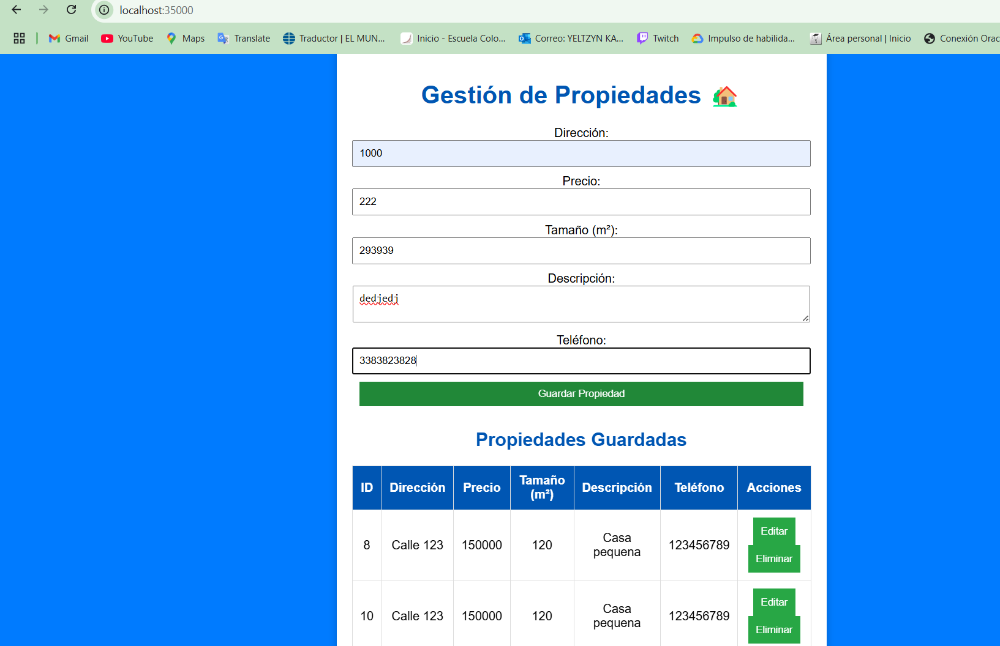
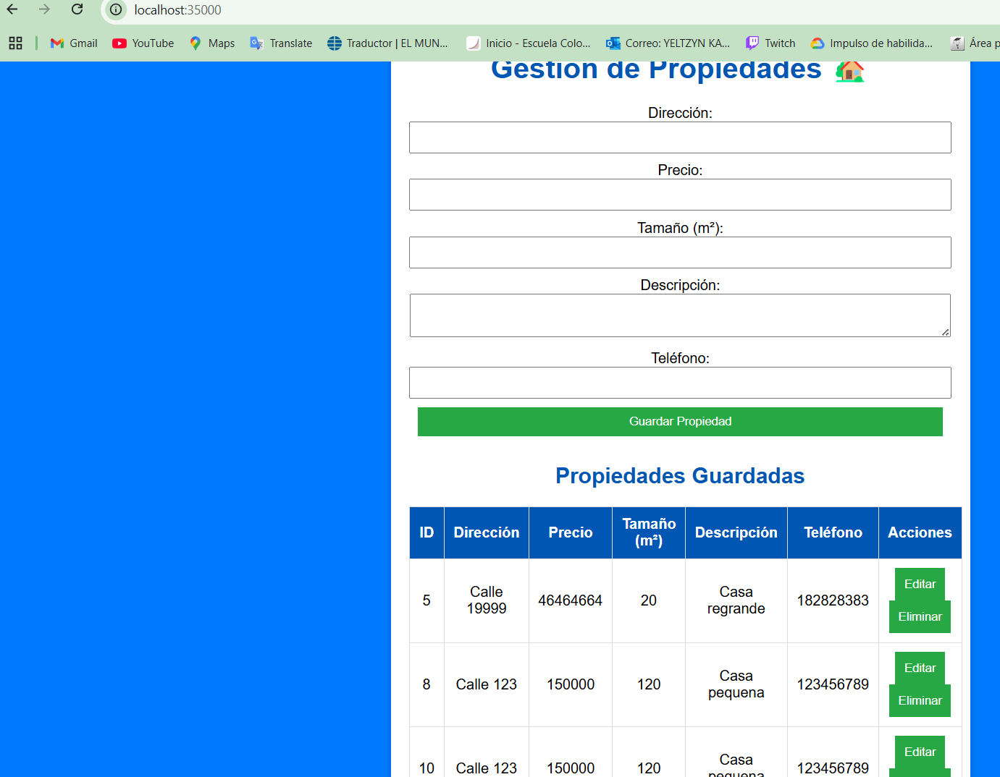

# **Taller de arquitectura empresarial: Diseño de aplicaciones de seguridad**

## **Resumen del Proyecto**

 **frontend** desarrollado en HTML, CSS y JavaScript. Almacenado en la instancia Servidor-Apache

   **backend** construido con **Spring Boot** y MySQL para la persistencia de datos. Almacenado en la instancia servidorback

  **base de datos** alojada en AWS EC2 utilizando MySQL.  Almacenado en la instancia database


# Proyecto 
El Property Management System es una aplicación web que permite gestionar propiedades mediante operaciones CRUD (Crear, Leer, Actualizar, Eliminar). Los usuarios pueden registrar propiedades con detalles como dirección, precio, tamaño, descripción y teléfono.

## Objetivo:
Características Clave de Seguridad:

Cifrado TLS: Transmisión segura de datos mediante certificados TLS generados con Let's Encrypt, lo que garantiza la confidencialidad e integridad.
Cliente Asíncrono: Nuestro cliente HTML+JavaScript utilizará técnicas asíncronas para optimizar el rendimiento y mantener una comunicación segura.
Seguridad de Inicio de Sesión: Implementaremos la autenticación de inicio de sesión, con contraseñas almacenadas de forma segura como hashes.
Implementación en AWS: Todos los servicios se implementarán y gestionarán en AWS, aprovechando su infraestructura segura y fiable.


## Arquitectura
```Bash
AREP-TALLER05/
│── src/
│   ├── main/
│   │   ├── java/
│   │   │   ├── com/edu/eci/arep/clase6/config
│   │   │   │   ├── PSecurityConfig.java
│   │   │   ├── com/edu/eci/arep/clase6/Contoller
│   │   │   │   ├── PropertyController.java
│   │   │   │   ├── AuthController.java
│   │   │   │   ├── HelloController.java
│   │   │   ├── com/edu/eci/arep/clase6/Model
│   │   │   │   ├── Property.java
│   │   │   │   ├── User.java
│   │   │   ├── com/edu/eci/arep/clase6/dto
│   │   │   │   ├── UserDto.java
│   │   │   ├── com/edu/eci/arep/clase6/Repository
│   │   │   │   ├── PropertyRepository.java
│   │   │   │   ├── UserRepository.java
│   │   │   ├── com/edu/eci/arep/clase6/Service
│   │   │   │   ├── PropertyService.java
│   │   │   │   ├── UserService.java
│   │   │   ├── WebSecure.java
│   ├── resources/
│   │   ├── img
│   │   ├── keystore
│   │   │   │── keystore.12
│   │   │   │── server.cer
│   │   ├── static
│   │   │   │── style.css
│   │   │   │── script.js
│   │   │   ├── index.html
│   │   │   │── loginscript.js
│   │   │   ├── login.html
│   │   ├── truststore
│   │   │   │── truststore.12
│   │   ├── application.properties
│── pom.xml
│── README.md
│── Dockerfile
│── docker-compose.yml
```

La arquitectura del sistema sigue un modelo en tres capas:

- **Frontend:** Aplicación web estática (HTML, CSS, JavaScript) alojada en el servidor y comunicándose con el backend mediante llamadas REST.
- **Backend:** API REST desarrollada en Java con Spring Boot, que expone servicios para la gestión de propiedades.
- **Base de Datos:** MySQL, con JPA/Hibernate para la persistencia de datos.

### Flujo de interacción:
1. El frontend envía solicitudes HTTP al backend.
2. El backend procesa las solicitudes y consulta la base de datos.
3. La respuesta se devuelve al frontend para ser mostrada en la UI.

## Class Design

### **1. Modelo de Datos**
- `Property`: Entidad que representa una propiedad con los atributos:
  - `id`
  - `address`
  - `price`
  - `size`
  - `description`
  - `phone`
- `User`  Representa un usuario en la base de datos.
- `id`
  - `username`
  - `password`

### **2. Capa de Persistencia**
- `PropertyRepository`: Interfaz que extiende `JpaRepository`, permitiendo operaciones CRUD sobre la base de datos.
- `UserRepository` : Accede a la base de datos para operaciones CRUD.

### **3. Capa de Servicio**
- `PropertyService`: Contiene la lógica de negocio y métodos para manejar propiedades.
- `UserService`: Gestiona la lógica de usuarios (crear, autenticar, buscar).

### **4. Capa de Controlador**
- `PropertyController`: Expone los endpoints REST para interactuar con las propiedades.
- `AuthController`: Expone endpoints para autenticación y registro.
- `Endpoints`: POST /api/auth/login

### **5. Capa de Seguridad**
- `SecurityConfig`: Configura seguridad (CORS, CSRF, permisos).

### **6. Capa de DTO**
- `UserDto`: ransfiere datos de usuario entre el cliente y el servidor.

## **Instalación** 

1. Descarga el repositorio remoto a tu local

    ```
    git clone https://github.com/YeltzynS/AREP_TALLER05.git
    
    ```
    
2. Entra en el directorio.
    
    ```
    cd AREP_TALLER05
    ```
    
3. Compila el proyecto:
    
    `mvn clean install`
   
#### Final work:
- GET

- POST

- PUT

- DELETE

### **Conexión mysql**
1. Crear la instancia con mysql.
2. Conectarse por SSH:
    
    ``` bash
    ssh -i "myfirstkey.pem" ec2-user@<instance-ip>
    ```
    
3. Instala docker y corre mysql:
    
    ``` bash
    sudo yum update -y
    sudo yum install docker -y
    sudo usermod -a -G docker ec2-user
    docker run --name contenedor_mysql -e MYSQL_ROOT_PASSWORD=root -e MYSQL_DATABASE=properties_db -p 3306:3306 -d mysql:latest
    ```
  
4. Ver que se creo la tabla:
   
   

### **Creación de Aplicación en EC2**
1. Crea una nueva instancia EC2 predeterminada en AWS
   


2. Conéctate a la instancia EC2 usando SSH
   
    ``` bash
    ssh -i "myfirstkey.pem" ec2-user@ec2-3-84-27-143.compute-1.amazonaws.com
    ```
3. Generación de certificados:
   Se crearon antes de crear las instancias, se creo el archivo keystore.p12 y asi mismo el trustore

   

4. Configura las propiedades de seguridad en application.properties:
     ``` bash
    server.port=8443 
    server.ssl.key-store=classpath:keystore/keystore.p12
    server.ssl.key-store-password=root123
    server.ssl.key-store-type=PKCS12
    server.ssl.key-alias=keystore
    server.ssl.trust-store=classpath:truststore/truststore.p12
    server.ssl.trust-store-password=root123
    server.ssl.trust-store-type=PKCS12
    ```
5. Compliamos para generar el .jar
   
    ``` bash
    mvn package
    ```
6. Sube el archivo SNAPSHOT.jar generado a la instancia EC2:
    ``` bash
    scp -i "myfirstkey.pem" "C:/Users/yelka/Downloads/clase6/clase6/target/clase6-1.0-SNAPSHOT.jar" ec2-user@ec2-107-20-129-169.compute-1.amazonaws.com:/home/ec2-user/
    ```
7. Conéctate a la instancia EC2 usando SSH
    ``` bash
    ssh -i "myfirstkey.pem" ec2-user@ec2-3-84-27-143.compute-1.amazonaws.com
    ```
8. Instala Java en la instancia EC2:
   ``` bash
    sudo yum install java-11-openjdk -y
    ```
9. Ejecuta la aplicación Java:
    
   ``` bash
    java -jar clase6-1.0-SNAPSHOT.jar
 
### **Configuración del Servidor Web en EC2 con Apache**
1. Lanzamos la instancia para el frondend.


2. Guarda los archivos estáticos y cárgalos en la instancia EC2 con el siguiente comando:
    
    ``` bash
    scp -i "myfirstkey.pem" index.html ec2-user@c2-3-84-27-143.compute-1.amazonaws.com:/home/ec2-user/
    scp -i "myfirstkey.pem" login.html ec2-user@c2-3-84-27-143.compute-1.amazonaws.com:/home/ec2-user/
    scp -i "myfirstkey.pem" script.js ec2-user@c2-3-84-27-143.compute-1.amazonaws.com:/home/ec2-user/
    scp -i "myfirstkey.pem" loginscript.js ec2-user@c2-3-84-27-143.compute-1.amazonaws.com:/home/ec2-user/
    scp -i "myfirstkey.pem" styles.css ec2-user@c2-3-84-27-143.compute-1.amazonaws.com:/home/ec2-user/
    ```
    
3. Conéctate a la instancia EC2 usando SSH:
      
      ``` bash
     ssh -i "myfirstkey.pem" ec2-user@ec2-3-84-27-143.compute-1.amazonaws.com
      ```
    
4. Instala Apache en la instancia EC2:
    
    ``` bash
    sudo yum install httpd -y
    sudo systemctl start httpd
    sudo systemctl enable httpd
    ```
5. Mueve los archivos estáticos a la carpeta /var/www/html:
    
    ``` bash
    sudo mv /home/ec2-user/index.html /var/www/html/
    sudo mv /home/ec2-user/login.html /var/www/html/
    sudo mv /home/ec2-user/script.js /var/www/html/
    sudo mv /home/ec2-user/loginscript.js /var/www/html/
    sudo mv /home/ec2-user/styles.css /var/www/html/
    ```
6. Reinicia Apache:
    
    ``` bash
   sudo systemctl restart httpd
    ```
## **Aplicación Funcionando graficamente**




      
## **Video Funcionando**
[](https://youtu.be/lIlZdTZqZBc)
---
## Corriendo los test 
Utiliza este comando para correr los test:
```
mvn test
```

### Construido Con
Java: El lenguaje de programación utilizado.
Maven: Herramienta de gestión de dependencias y construcción.
JUnit: Framework de pruebas.
Docker: Herramienta de contenedorización.
### Author
- Yeltzyn Sierra
  
### License
This project is licensed under the MIT license: see the LICENSE.md file for details.
